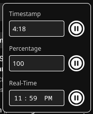

# pause-timer-for-youtube

Pause Timer for YouTube is a browser extension that pauses YouTube videos by entering the timestamp or percentage. Useful for those who watch long YouTube videos.

## Gallery
| Light Interface | Dark Interface |
| :---: | :---: |
|  |  |
|  |  |

| Image 1 | Image 2 |
| :---: | :---: |
|  |  |

## Key Features

## Getting Started

### Installation

#### Extension Store
* Install on [Chrome](https://chromewebstore.google.com/detail/pause-timer-for-youtube/magjipjiapiklggpnfmkdmfdiadonlnh)
* Install on [Firefox](https://addons.mozilla.org/en-CA/firefox/addon/pause-timer-for-youtube/)

#### Local Install
If you want to run the extension locally:
1. Clone the Repository: `git clone https://github.com/abelhabte/pause-timer-for-youtube.git`
2. Open Extension Management:
    * Chrome: Navigate to `chrome://extensions/` and turn on Developer mode.
    * Firefox: Navigate to `about:debugging#/runtime/this-firefox`.
3. Load the Extension:
    * Chrome: Click Load unpacked and select the project folder.
    * Firefox: Click Load Temporary Add-on and select the manifest.json file.

### Basic Usage

## Technical Stack
* **HTML**
* **CSS**
* **JavaScript**
* **Manifest V3**
